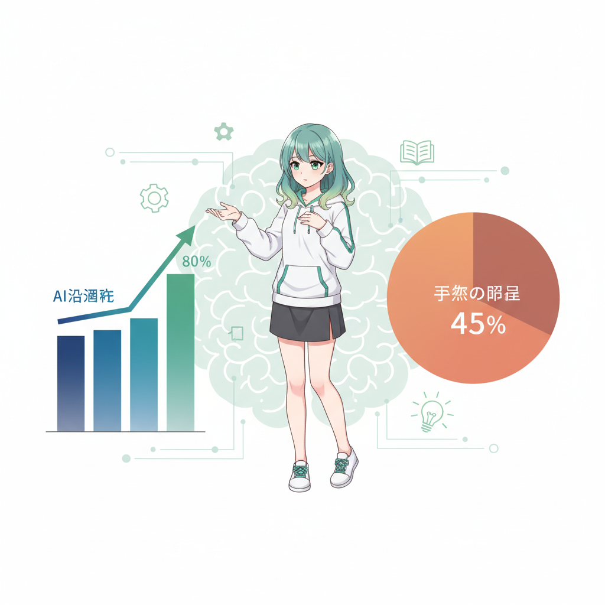
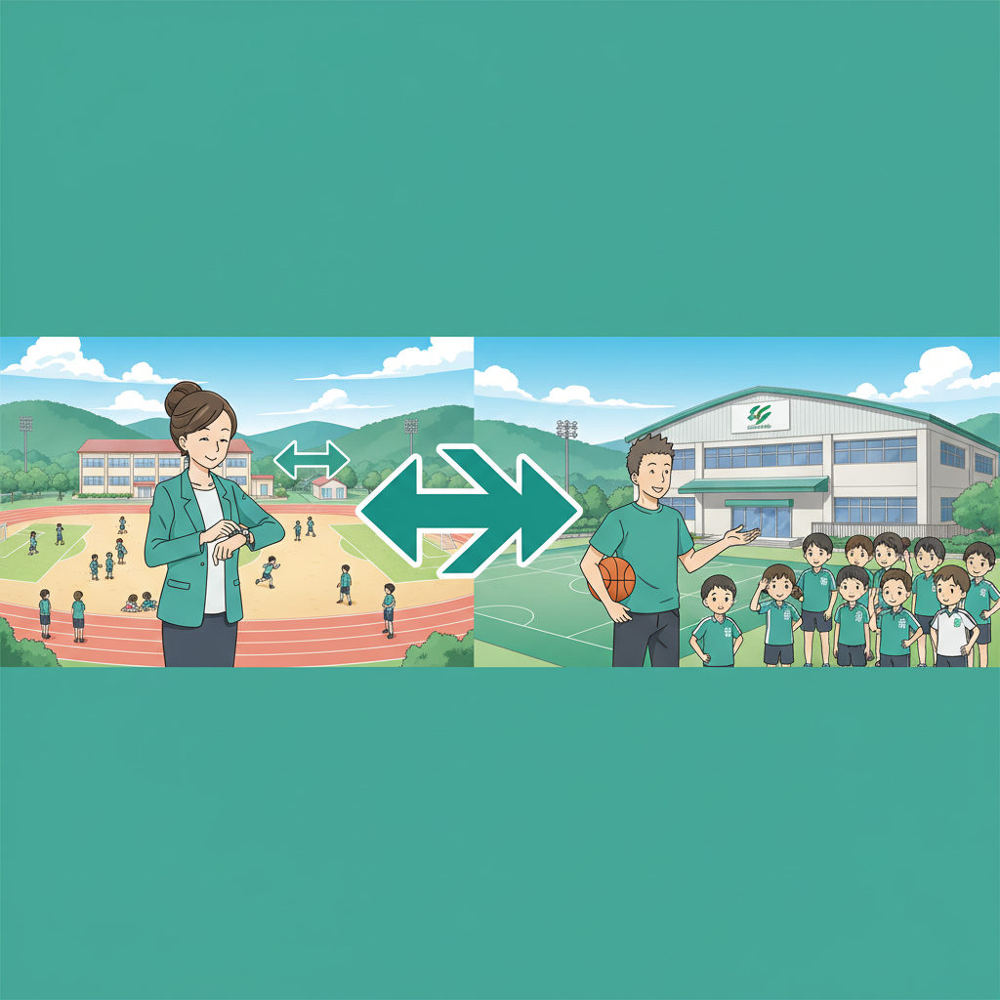
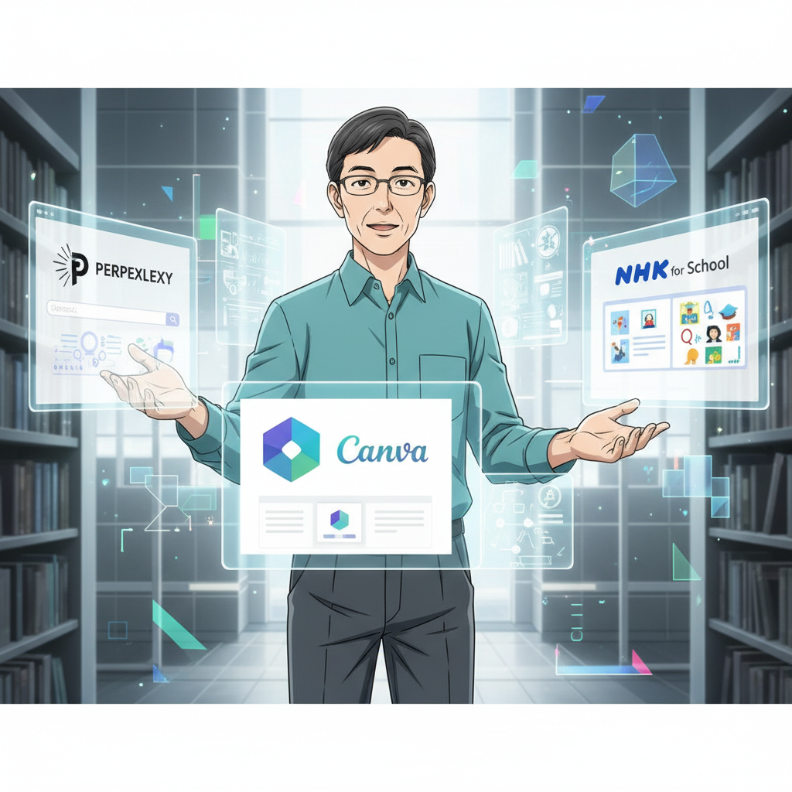

<!-- _class: lead -->

# 2026年 教育×AI 3つの重要トレンド

## AI活用・部活動改革・EdTechの今と未来

**if(塾) Blog** | 2026年01月06日

---

# 2026年の教育現場：現状とギャップ

- AI活用率は38.5%まで上昇し普及が進む
- 一方で80%がAI利用に依然として不安を抱く
- 技術の進化スピードに現場の意識が追いついていない
- 2026年は教育DXの真価が問われる年

---

# トレンド1：Shallow Learning（浅い学習）

## AI依存による新たな課題

- AIが即座に答えを出すことによる思考停止の懸念
- プロセスを飛ばし、深い理解が妨げられる現象
- 「AIを使いこなす」か「AIに使われる」かの分岐点
- 思考力を守るための授業設計が急務

---

# トレンド2：部活動の地域移行、本格化

## 働き方改革の決定打となるか

- 2026年度より改革が実行フェーズへ移行
- 教員の休日負担軽減と引き換えの調整コスト
- 地域人材の確保と質の担保が課題
- 学校と地域の新しい連携モデルの構築

---

# トレンド3：EdTech市場の淘汰と再編

## 本質的な効果が問われる時代

- 多くのスタートアップが統合・淘汰されるフェーズ
- 「導入しただけ」のツールは排除される
- 科学的根拠（エビデンス）に基づくツール選定
- Engageli等のアクティブラーニング支援ツールに注目

---

# GIGAスクール Next Phase

## 端末更新と環境整備の課題

- 初期導入端末の更新時期（Next GIGA）の到来
- スペック不足や故障による学習中断を防ぐ
- 安定したネットワーク環境がAI活用の大前提
- デジタル格差を生まないための予算確保

---

# 最新研究：AI活用の光と影

## ScienceDaily等のデータより

- ADHD児へのAI支援ツールが学習効果を向上
- 個々の特性に合わせたきめ細かなサポートが可能
- 一方で過度な依存は自律性を損なうリスクも
- データに基づいた適度な距離感が重要

---

# デジタルリスクへの対応

## 情報モラル教育の重要性

- AI生成情報の真偽を見抜く「ファクトチェック」
- デジタルタトゥーやネットいじめの深刻化
- 技術操作だけでなく倫理観を育む教育が必要
- 家庭と学校が連携したルール作り

---

# 実践：推奨AIツール3選

## 教育現場で効果的なツール

- Perplexity AI：出典元が明記され信頼性が高い検索
- Canva for Education：直感的な操作で創造性を育成
- NHK for School：質の高い動画教材とAIの連携
- それぞれの特性を理解し、授業の目的で使い分ける

---

# 現場での対策アドバイス

## AI時代に教師ができること

- AIを禁止せず「賢く使う」方法を共に考える
- 人間にしかできない「対話」や「体験」を重視
- 教師自身がAIを触り、アップデートし続ける
- 失敗を恐れず新しい授業スタイルに挑戦する

---

# まとめ：2027年以降を見据えて

- AIは特別な魔法ではなく「インフラ」になる
- 個別最適化（AI）と協働学習（人）のハイブリッド
- 知識の暗記から「問いを立てる力」へシフト
- 変化を楽しむマインドセットが最強の武器

---

# 未来の教育を共に創ろう

## Next Steps

- まずは今日紹介したツールを一つ試してみる
- 同僚や地域と課題を共有し連携する
- 最新の教育トレンドをキャッチアップし続ける
- 詳細はブログ記事「2026AI3」をチェック！
