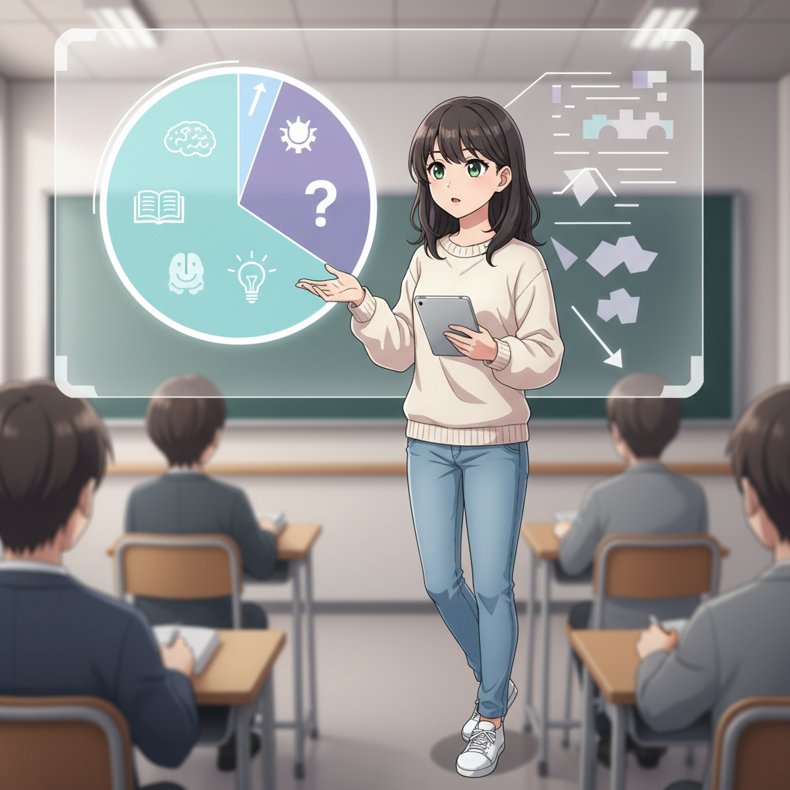
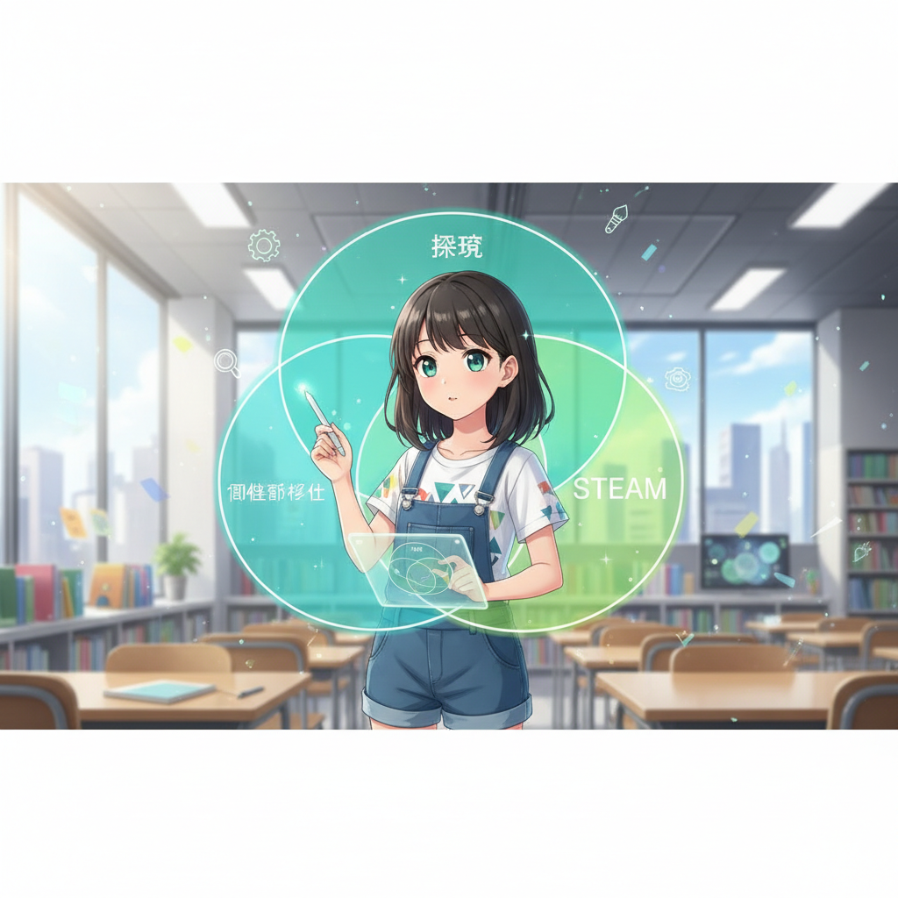
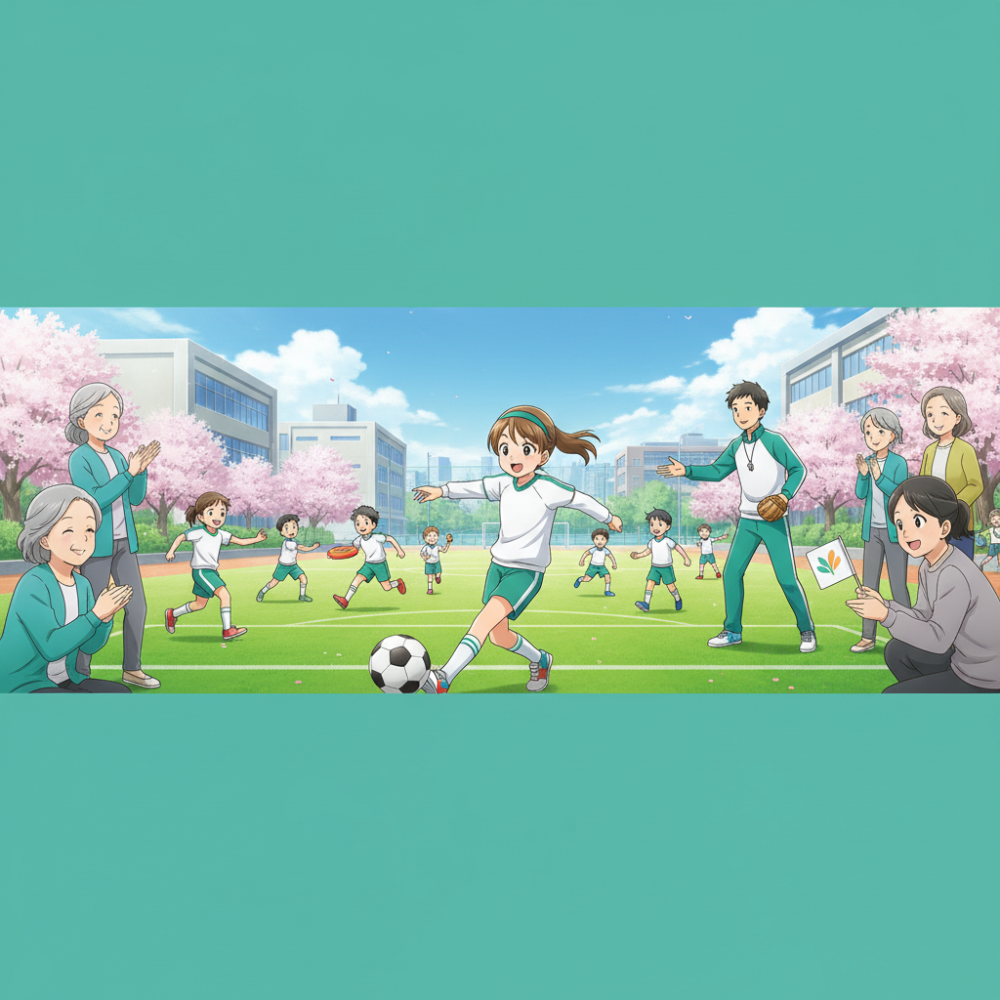
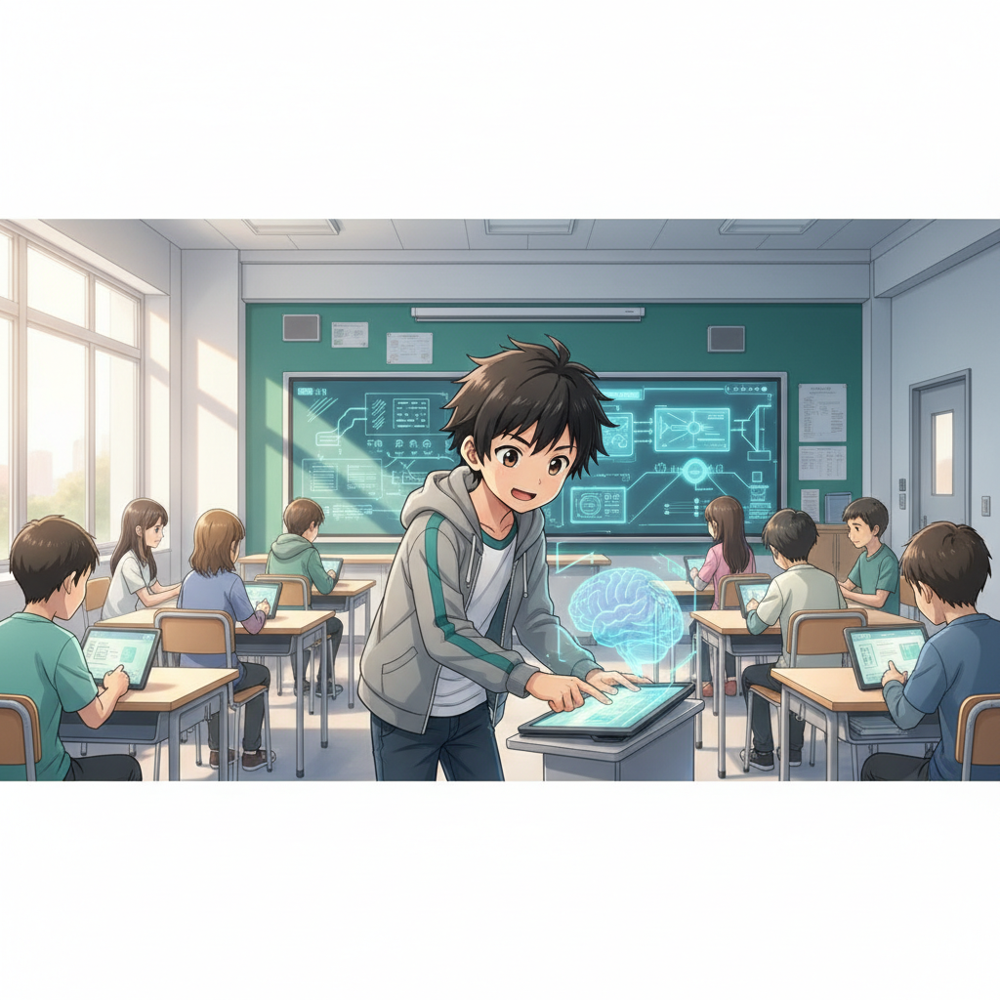
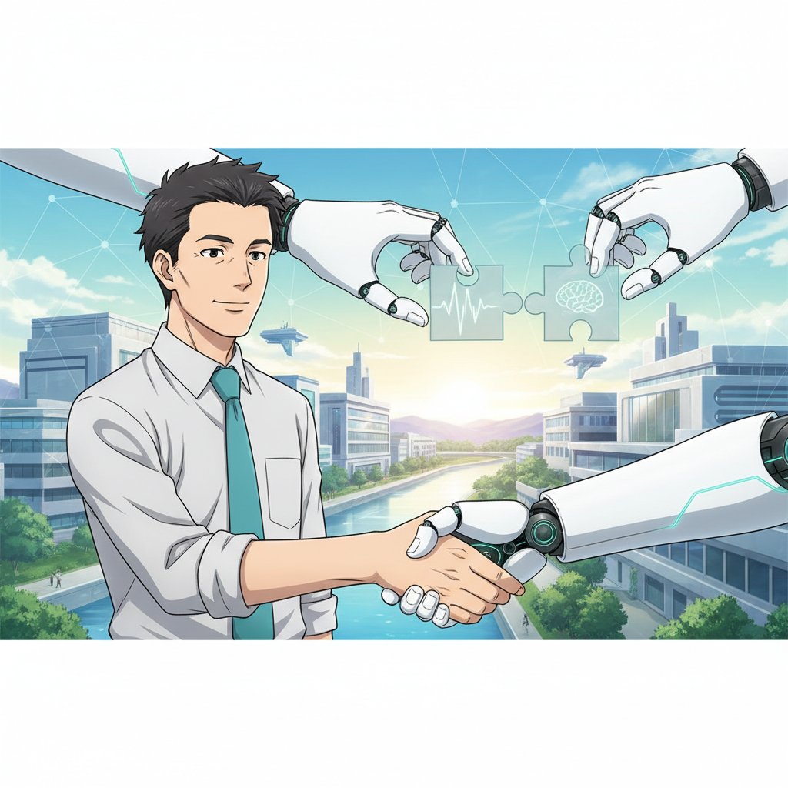

<!-- _class: lead -->

# 2026年 教育トレンド予測

## AI活用・部活動改革・新たな学びの形

**if(塾) Blog** | 2026年01月06日

---

# 2026年、教育の転換点

## 激動の年を迎える教育現場

- 生成AI登場から3年、教育への浸透が進む
- 部活動の地域移行が本格化する年
- 「AI活用」と「人間性」のバランスが問われる
- 教育DXによる学びの質の変革

---

# AI活用の現状と課題

## 教員の意識調査データより

- 教員の38.5%がAI活用に前向きな姿勢
- 一方で80%が導入に不安や懸念を感じている
- リテラシー格差とガイドラインの必要性
- 現場の負担感と期待が交錯している状況

---

# 教育現場の3大キーワード

## これからの学びに必要な要素

- 個別最適化：AIによるパーソナライズ学習
- 探究学習：自ら問いを立て解決する力
- STEAM教育：理数と創造性の融合
- 注意点：思考を省略する「Shallow Learning」

---

# 部活動改革の行方

## 地域移行による環境の変化

- 2026年度より休日部活動の地域移行が加速
- 教員の長時間労働是正への大きな期待
- 指導の質の維持と外部指導員の確保
- 保護者の費用負担と地域格差の課題

---

# 最新研究：AIと学習効果

## データが示すAIの可能性

- アクティブラーニング参加率が向上する傾向
- 学習効率が最大1.5倍になるという報告も
- ADHD等、特性ある生徒への支援ツールとして有効
- 個々のペースに合わせた学習支援が可能に

---

# 教室のデジタル化と変化

## ハードウェアと環境の進化

- PC/タブレットの必携化（BYOD）が進む
- デジタル教科書とAIドリルの連携活用
- 校務支援AIによる教員の業務効率化
- データに基づく指導（エビデンスベース）

---

# 2026年 注目ツール3選

## 教育現場で役立つAIツール

- Perplexity AI：出典元が明記されるAI検索
- Canva for Education：直感的なデザイン作成
- NHK for School：信頼性の高い動画教材
- 各ツールの特性を理解し使い分けることが重要

---

# 教育者への5つの提言 (1)

## マインドセットの変革

- AIを「禁止」せず「共存」する道を探る
- 情報リテラシー教育を最優先事項に
- AIの回答を鵜呑みにせず批判的に見る訓練
- 「問いを立てる力」こそが重要になる

---

# 教育者への5つの提言 (2)

## 指導スタイルの転換

- 知識伝達者から「学習の伴走者」へ
- 生徒の主体性を引き出すファシリテーション
- 家庭学習におけるAI活用のルール作り
- 変化を恐れず、新しい技術を試す姿勢

---

# 今後の展望：2027年以降

## AIネイティブ時代の到来

- AI活用が「特別なこと」から「日常」へ
- 個人の興味・関心に基づく学びの深化
- 場所や時間にとらわれない学習の実現
- テクノロジーで教育格差の解消を目指す

---

# まとめ・結論

## 未来に向けたアクション

- 2026年は教育システム変革の重要な年
- AIと部活動改革をポジティブに捉える
- 生徒と共に学び、成長し続けることが鍵
- 新たな学びの形を共に創り上げていきましょう
