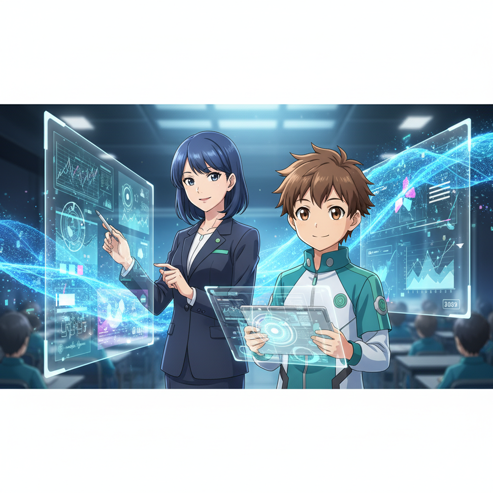
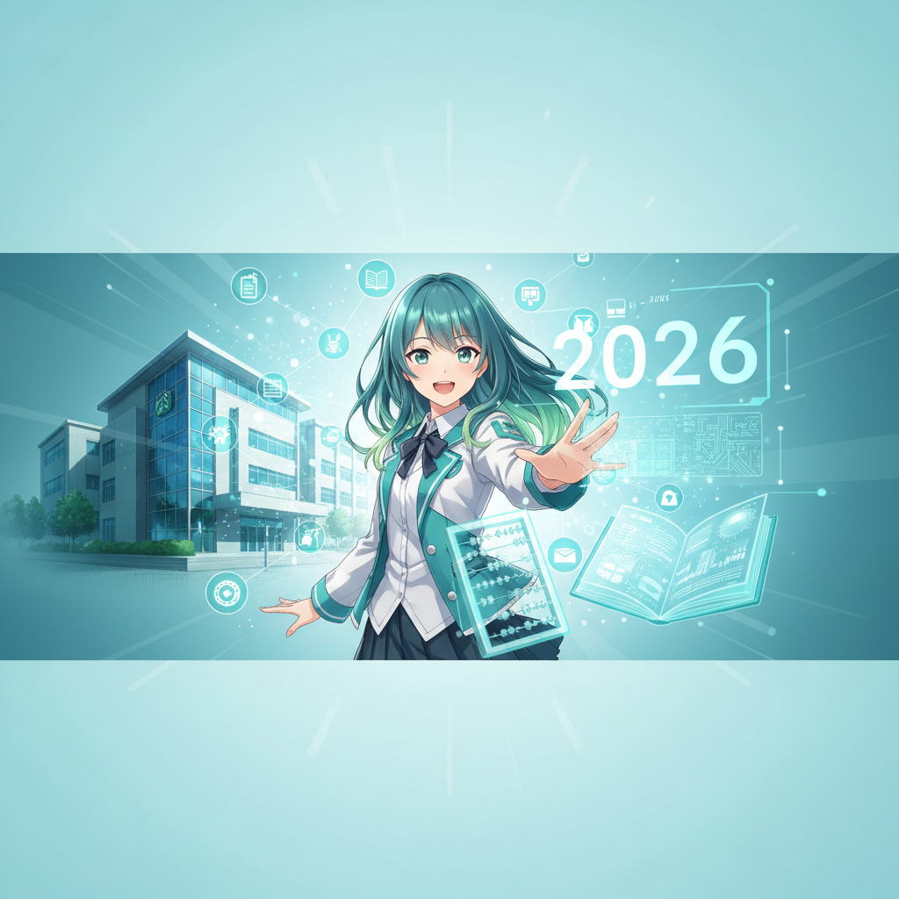
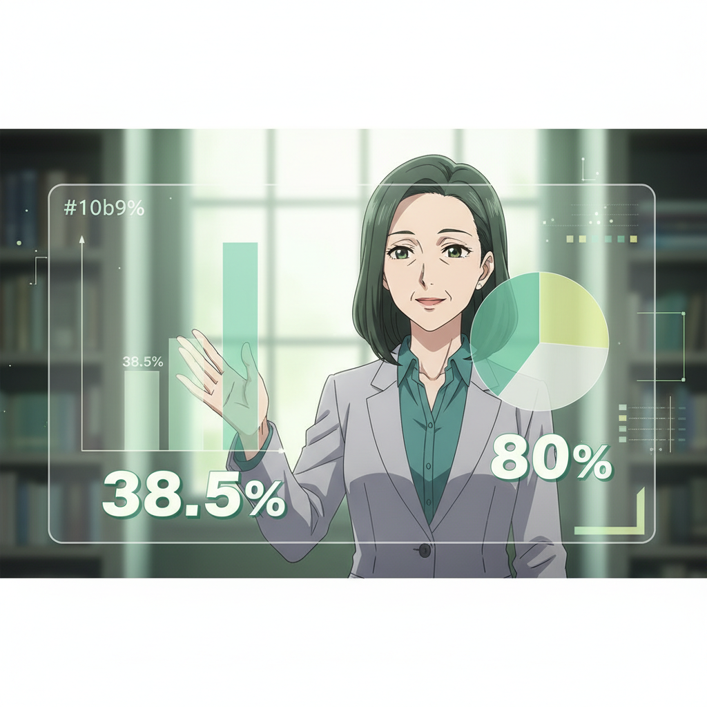

<!-- _class: lead -->

# 2026年 教育×AI 3つの波

## GIGA第2期・部活動改革・AI活用を乗り越える戦略

**if(塾) Blog** | 2026年01月06日

---

# 2026年、教育現場の大転換期

- 2026年は教育DXの重要な分岐点
- 「GIGAスクール第2期」の開始
- 「部活動の地域移行」が本格化
- AI活用が日常化する中での新たな課題

---

# データで見る教育現場の現状

- 教員の生成AI利用率は38.5%に留まる
- 一方で80%がAIによる業務効率化に期待
- 校務DXの進捗は20.5%と遅れている
- 現場の期待と環境整備にギャップが存在

---

# 第1の波：部活動改革の衝撃

- 2026年度より地域移行がさらに加速
- 兼職兼業ルールの明確化が進む
- 教員の長時間労働是正への期待
- 外部指導員との連携がカギとなる

---

# 第2の波：GIGAスクール第2期

- 学習者用端末の更新時期（Next GIGA）
- 単なる導入から「日常的な活用」へシフト
- ネットワーク環境の増強が急務
- AI活用を前提としたスペック選定が必要

---

# 第3の波：AI活用の深化と影

- 授業準備や校務でのAI活用が標準化
- 「Shallow Learning（浅い学び）」への懸念
- AIに依存し思考力を失うリスクへの対策
- アクティブラーニングでの有効活用が重要

---

# 現場に立ちはだかる「3つの壁」

- 1. リテラシーの壁：教員間のスキル格差
- 2. 環境の壁：ネットワークやセキュリティ制限
- 3. 意識の壁：変化への抵抗や不安感
- これらをどう乗り越えるかが成功の鍵

---

# 壁を突破する解決アプローチ

- 校務系：生成AIで書類作成時間を短縮
- 学習系：個別最適化されたAIドリルの活用
- 体制面：校内研修とスモールステップの実践
- 失敗を許容し、共有する文化の醸成

---

# 明日から使える実践ツール3選

- Perplexity AI：情報検索・教材研究の効率化
- Canva for Education：視覚教材を短時間で作成
- NHK for School：信頼できる動画×AI活用
- まずは無料版や教育版から試してみる

---

# 2026年を生き抜く5つの指針

- AIを「相棒」として使いこなす
- 「浅い学び」に陥らないよう指導を工夫
- 変化を恐れず、新しいツールを試す
- 生徒と共にデジタル活用を学ぶ姿勢
- 人間らしい対話やケアを大切にする

---

# まとめ：テクノロジーで人間らしさを

- 2026年は課題も多いが変革のチャンス
- AIに単純作業を任せ、教員は生徒と向き合う
- GIGA第2期を「学びの質」向上の契機に
- 2027年以降の教育を見据えた土台作りを

---

# Next Step

- まずは1つのAIツールを触ってみましょう
- 同僚と小さな成功事例を共有してください
- 変化の波を乗りこなし、新しい教育の形へ
- ご清聴ありがとうございました
