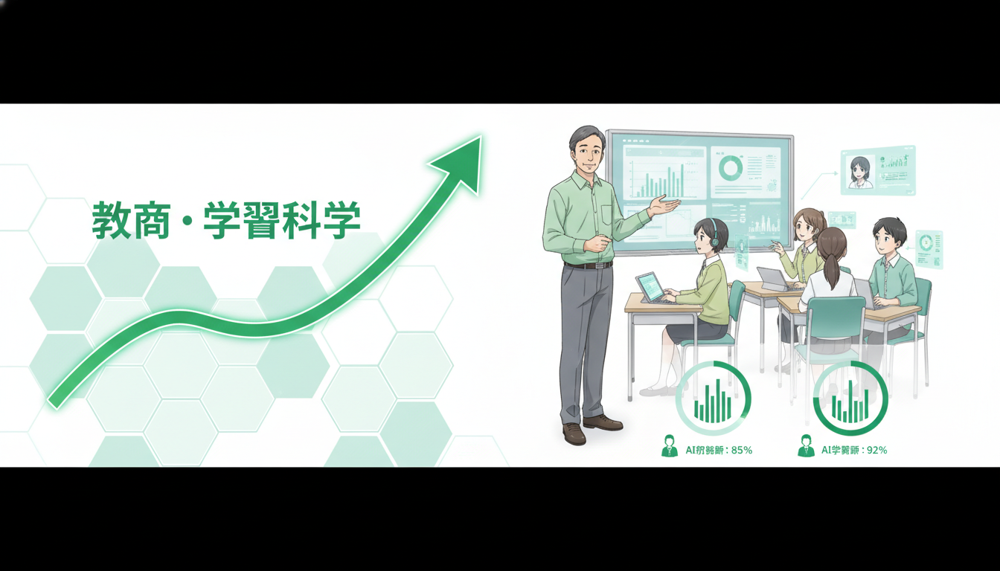
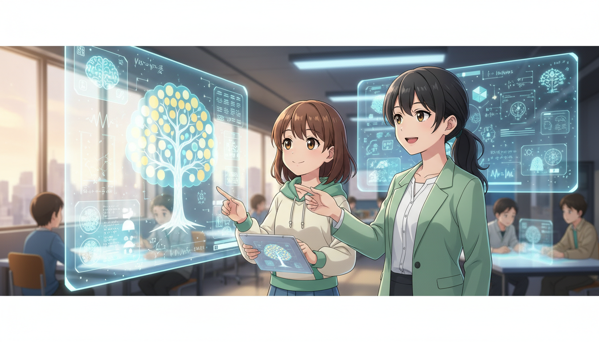
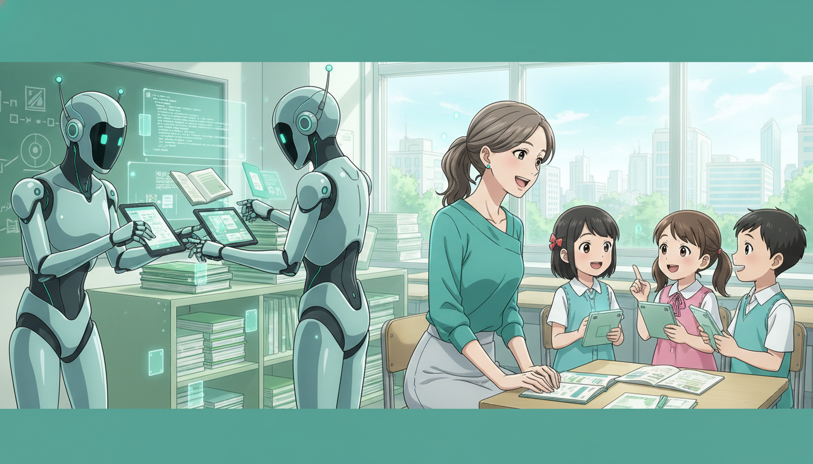
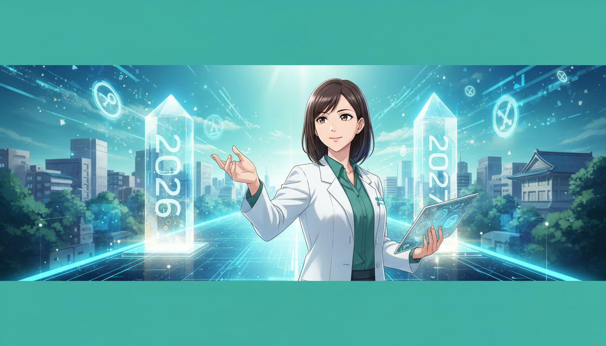
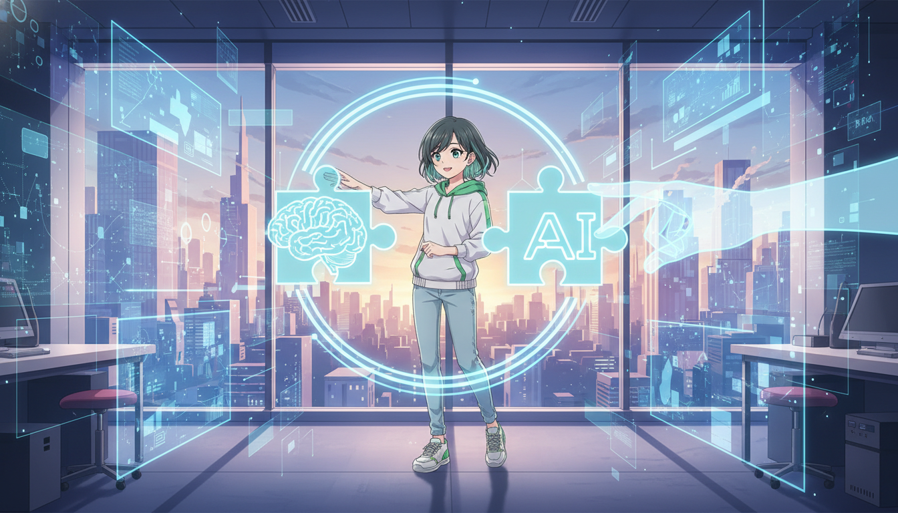

<!-- _class: lead -->

# 2026年 EdTechトレンドとAI

## 教育の未来：ツールから「インフラ」へ

**if(塾) Blog** | 2026年01月06日

---

# 加速するAI導入の現状

## 数字で見る2025-2026年の市場

- 2025年の市場規模は1,770億ドルに到達
- 教員の54%が生成AIを毎日業務で利用
- 76%の学校がAI関連予算の増額を計画
- 単なるブームを超え、実用段階へ移行

---

# トレンド1：探究学習の進化

## Inquiry-Based Learning

- AIは「正解マシン」から「思考の壁打ち相手」へ
- 結果（Output）よりプロセス（Process）を重視
- 批判的思考力を養うためのAI活用
- 生徒自らが問いを立てる力の育成

---

# トレンド2：AIのインフラ化

## AI as Infrastructure

- LMS（学習管理システム）への標準統合
- 意識せずに使える「空気のようなAI」へ
- ツールごとの分断からシームレスな連携へ
- 1EdTechが提唱するエコシステムの構築

---

# トレンド3：データガバナンス

## Data Governance & Ethics

- 教育データのプライバシー保護強化
- AI利用における倫理的ガイドラインの策定
- 安全な学習環境の担保が最優先課題
- データの透明性と信頼性の確保

---

# トレンド4：プレバンキング

## Pre-bunking (予防的・免疫的措置)

- 誤情報に対する「情報の免疫」を獲得させる
- AIのハルシネーションを見抜くリテラシー
- ファクトチェック能力の向上
- 情報の真偽を判断するクリティカルシンキング

---

# 教師の役割の再定義

## TeachingからFacilitatingへ

- ファシリテーター：学びの伴走・促進
- キュレーター：最適なAI・教材の選定
- メンター：感情面のケアとモチベーション管理
- AIにできない「人間らしい指導」への特化

---

# 実践：LLMとRAGの活用

## 現場での具体的なAI運用

- LLM活用：採点、フィードバック、校務の自動化
- RAG（検索拡張生成）：学校独自データに基づく回答
- AIチューター：生徒一人ひとりに合わせた個別指導
- 教員の長時間労働是正への寄与

---

# 2026年 注目のツール

## 教育現場を変える3つのサービス

- ClassPoint：PowerPointにAIクイズ作成を統合
- Perplexity AI：高精度な検索と情報ソース提示
- Canva：視覚教材作成のAIアシスト
- 既存ツールへのAI機能追加が加速

---

# 今後のロードマップ

## 2027年に向けて

- 2027年：CBT（コンピュータ上での試験）本格化
- GIGAスクール構想 NEXTステージへの移行
- 「1人1台端末」から「1人1AI」の時代へ
- データ駆動型教育の定着

---

# まとめ：2026年の教育

## AIとの共存が当たり前の世界へ

- AIは特別なツールではなく「インフラ」になる
- 「問いを立てる力」と「倫理観」が重要スキル
- 教師は人間的な関わりにリソースを集中する
- 変化を恐れず、主体的にAIを活用する姿勢

---

# Next Action

## 明日から始められること

- まずは校務の小さなタスクからAIに任せる
- 「答え」ではなく「プロセス」を問う授業設計
- 最新のEdTechトレンドを継続的にキャッチアップ
- AIと共に、新しい学びの形を創造しましょう
