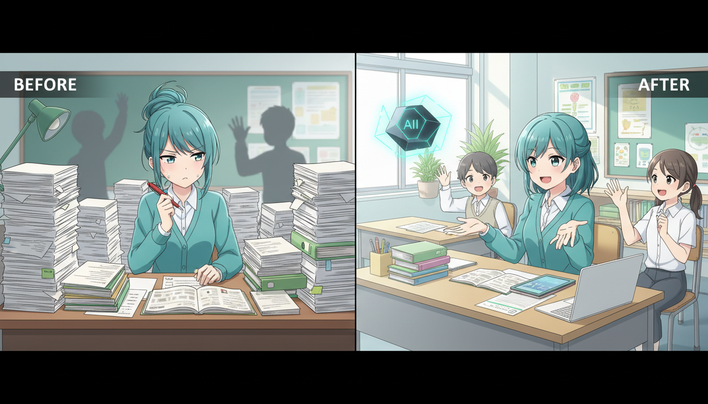
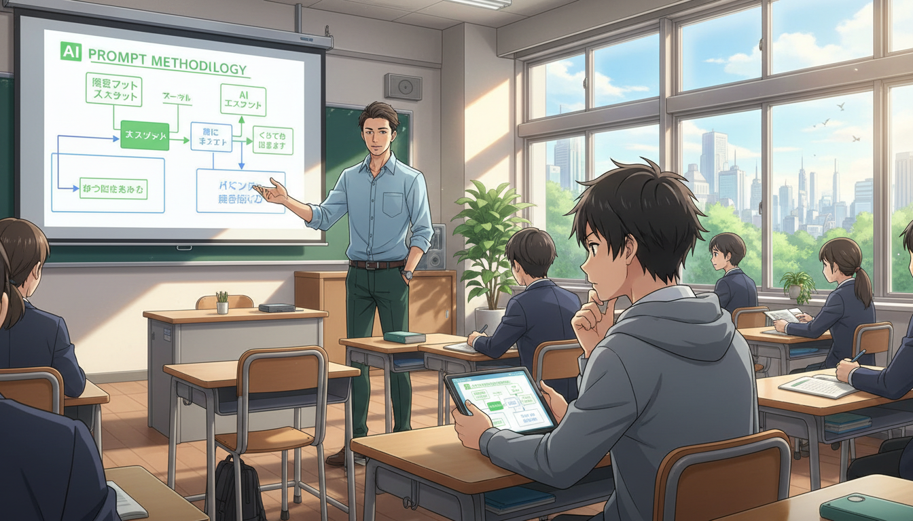

<!-- _class: lead -->

# 2026年 教育×AIの最新トレンド

## 市場規模1,770億ドル時代、教師の54%がAIを活用する未来へ

**if(塾) Blog** | 2026年01月06日

---

# 急拡大するEdTech市場の現状

## 2025年から2026年にかけての劇的な変化

- 世界市場規模は1,770億ドルに到達（2025年）
- 教師の54%がすでに授業や業務でAIを活用
- 学校の76%がAI導入済み、または導入予定
- AIは「ツール」から「インフラ」へ進化

---

# トレンド①：探究学習の進化

## Inquiry-Based LearningとAIの融合

- 「答えを知る」から「問いを立てる」学習へ
- AIが生徒の思考を深める壁打ち相手になる
- 批判的思考（クリティカルシンキング）の重要性が増大
- プロセス重視の評価への転換

---

# トレンド②：インフラとしてのAI

## AI as Infrastructure

- LMS（学習管理システム）にChatGPT等が標準搭載
- 特別な操作なしで自然にAIを利用する環境
- 校務支援システムとの連携で業務効率化
- データに基づいた個別最適化された指導案作成

---

# トレンド③：データガバナンスと倫理

## 安全な利用とメディアリテラシー

- 教育データのプライバシー保護規定の厳格化
- Pre-bunking（偽情報の事前無効化）教育の導入
- AIが生成する情報の真偽を見極める力の育成
- 「使わせない」から「正しく使う」へのシフト

---

# 教師へのメリット：働き方改革

## AIによる業務負担の劇的な軽減

- テスト採点や評価の自動化・補助
- 個別の指導案や教材作成の時間を短縮
- 単純作業をAIに任せ、生徒との対話に注力
- 残業時間の削減と教育の質の向上を両立

---

# 生徒へのメリット：個別最適化と没入感

## AIチューターとゲーミフィケーション

- 24時間対応のAIチューターによる学習サポート
- Classroom Adventure等の没入型学習の普及
- 自分のペースや理解度に合わせたカリキュラム
- 学習意欲を高めるインタラクティブな体験

---

# 2026年 注目のAIツール

## 教育現場で導入が進む主要サービス

- ClassPoint：PowerPointにAIクイズ作成機能を追加
- Perplexity AI：信頼性の高い情報検索・リサーチ
- Canva：直感的な教材・スライド作成デザイン
- 1EdTech：教育技術の標準化を推進するコンソーシアム

---

# 実践①：導入に向けた準備

## まず何から始めるべきか

- 校内のデータ取り扱いポリシーの策定・確認
- GIGAスクール端末などハードウェア環境の整備
- 教職員向けのAIリテラシー研修の実施
- 保護者へのAI活用方針の説明と合意形成

---

# 実践②：授業での具体的な活用

## 効果的なプロンプトとRAGの活用

- RAG（検索拡張生成）で教科書に基づいた回答を生成
- 生徒に「良い問い（プロンプト）」の作り方を指導
- アイデア出しや構成案の作成にAIを利用
- 最終的な判断は人間が行うことを徹底

---

# まとめ：2026年の教育像

## AIとの共存が当たり前の時代へ

- AIは教師を代替するものではなく、最強のパートナー
- 「知識の暗記」から「知識の活用・創造」へ
- 倫理観と批判的思考を持ったAIネイティブの育成
- テクノロジーで教育の公平性と質を高める

---

# Next Action

## 教育の未来を共に創りましょう

- まずは無料のAIツールを一つ試してみる
- 校内の「AI活用推進チーム」を立ち上げる
- 最新のEdTechトレンド情報を定期的に収集する
- 2026年の教育変革は、今日の一歩から始まる
