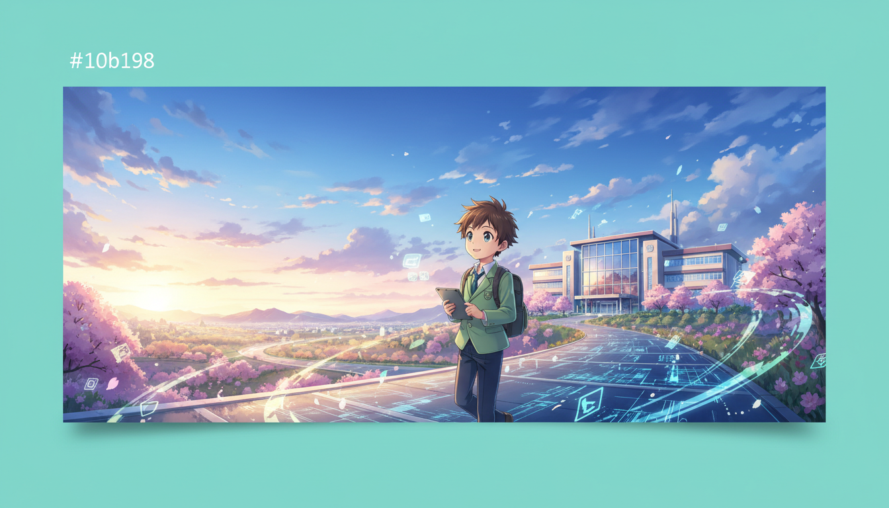

<!-- _class: lead -->

# 2026年 AI教育トレンド予測

## 「ツール」から「パートナー」へ：教育現場のAI活用最前線

**if(塾) Blog** | 2026年01月06日

---

# 現状：加速するAI教育市場

## 数字で見る2025-2026年の変化

- 世界のEdTech市場規模は1,770億ドルに到達
- 教師の54%が既に授業準備等にAIを活用中
- 管理職の76%がAI導入の拡大を予測
- AI活用率は46%からさらに上昇傾向にある

---

# トレンド1：探究学習の進化

## Inquiry-Based Learning

- AIは「正解を出す機械」から「思考のパートナー」へ
- 生徒がAIに問いかけ、対話を通じて深める学習
- 批判的思考（クリティカルシンキング）の重要性が増大
- 「答え」よりも「問い」の質が問われる時代

---

# トレンド2：インフラとしてのAI

## AI as Infrastructure

- 単体のチャットボットからシステム全体への統合へ
- LMS（学習管理システム）にAI機能が標準装備
- 出席・成績管理などの事務作業を自動化
- 教員が「生徒と向き合う時間」を創出する基盤

---

# トレンド3：データガバナンスと倫理

## Data Governance & Pre-bunking

- 教育機関におけるデータ管理とプライバシー保護の強化
- 偽情報を防ぐ「Pre-bunking」教育の重要性
- AIが生成する情報の真偽を見極めるリテラシー
- 安全なAI利用環境の整備が急務

---

# トレンド4：ゲーミフィケーション

## 没入型学習体験の創出

- Classroom Adventure等が予測する「冒険する学び」
- AIが生徒の興味に合わせて教材をストーリー化
- 即時フィードバックによる学習意欲の向上
- 「勉強」を「エンターテインメント」に変える技術

---

# 教育現場の役割変化

## 教師と生徒の関係性の再定義

- 教師：知識の伝達者から「学習のファシリテーター」へ
- 生徒：受動的学習者から「能動的な探究者」へ
- 評価：結果だけでなく「プロセス」を重視するAI評価
- 個別最適化された学び（Adaptive Learning）の実現

---

# 2026年の注目ツール

## 教育を変える具体的なソリューション

- ClassPoint：PowerPoint内でAIクイズを即時生成
- Perplexity AI：信頼性の高いソース付き検索学習
- Canva：視覚教材をAIで瞬時に作成・編集
- 1EdTech：ツール間の相互運用性を保証する標準規格

---

# 実践アドバイス：教員編

## 明日からできるAI活用

- まずは授業準備（案の作成・教材作り）でAIを試す
- 生徒と一緒にAIの回答を検証する時間を設ける
- 「良いプロンプト（指示）」の出し方を学ぶ
- 失敗を恐れず、AI活用の事例を同僚と共有する

---

# 実践アドバイス：管理者編

## 組織としてのAI導入戦略

- 明確なAI利用ガイドラインの策定と周知
- 教員向けのAI研修（OJT）や勉強会の実施
- セキュリティ基準を満たしたツールの選定
- 保護者への透明性ある説明と合意形成

---

# まとめ：2026年の展望

## AIと共に歩む教育の未来

- 2026年はAI教育の「実用化・定着」の年
- 大学入試（共通テスト）等でもCBT/AI活用が進む
- AIは脅威ではなく、人間の能力を拡張するツール
- テクノロジーと人間性のバランスが教育の質を決める

---

# Next Step

## 行動を起こしましょう

- まずは1つのAIツールを触ってみることから
- 「AI教育」の最新トレンドを継続的にキャッチアップ
- 生徒と共に新しい学びの形を創造する
- 教育の未来は、現場の皆様の手にあります
