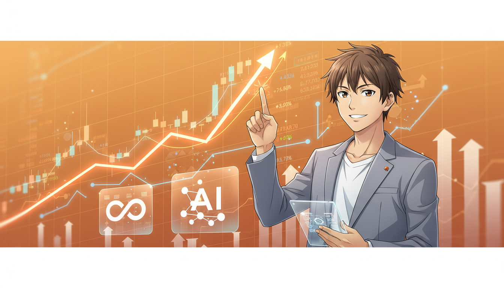
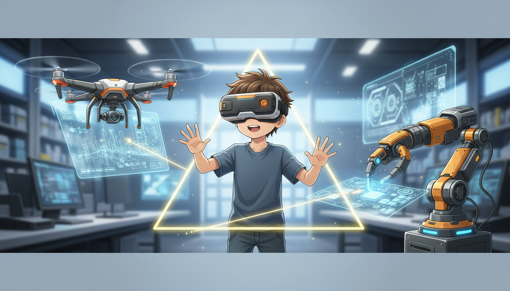
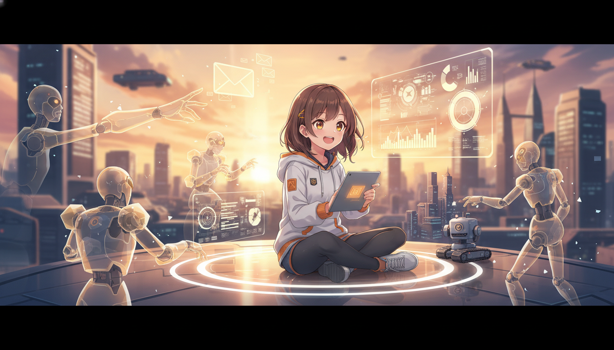
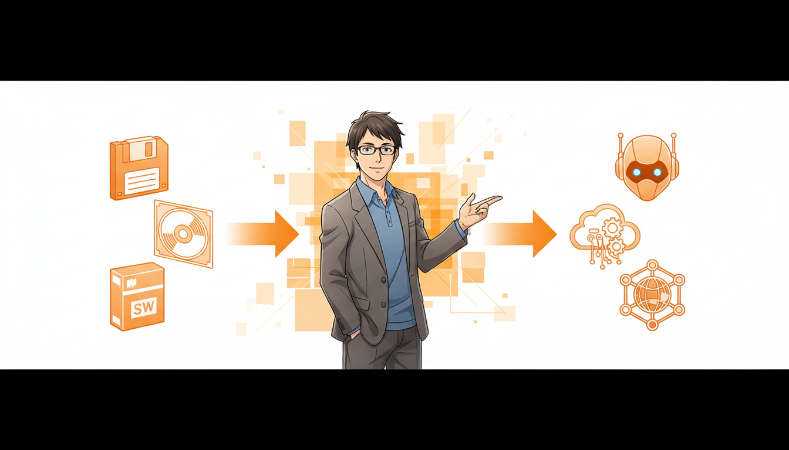
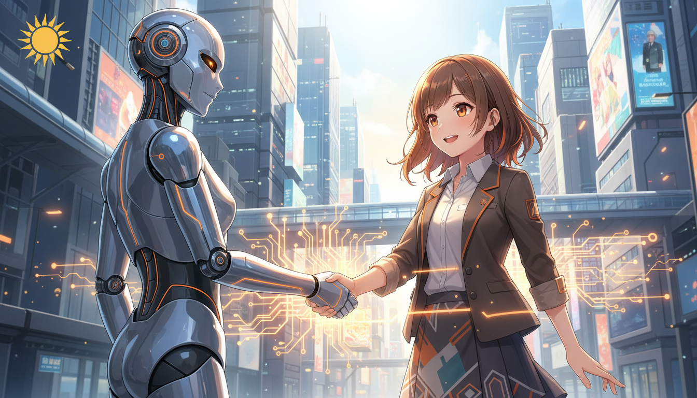

<!-- _class: lead -->

# 2026年 AIトレンドと3大ニュース

## Metaの巨額買収から読み解く「AI Real World」時代の到来

**if(塾) Blog** | 2026年01月07日

---

# 2026年AI市場の幕開け

## 巨額投資と市場の回復

- MetaがManus AIを約30億ドルで買収しXR×AIを強化
- xAI等のヘクトコーン企業が市場を牽引し競争激化
- IPO市場が回復基調、ディープテック企業への注目高まる

---

# 注目すべき3つの主要ニュース

## 業界地図を塗り替えるプレイヤーたち

- Meta×Manus：AIOS覇権を狙い、UI/UXを革新
- SORA Technology：ドローン×AIで新興国課題を解決
- Closer Robotics：AIロボットによる省人化・自動化の加速

---

# 新たな潮流：Agentic AIとDeep Tech

## 「対話」から「行動」するAIへ

- Agentic AI：自律的に思考しタスクを完遂するAIの台頭
- Deep Tech：宇宙・ロボットなどハードウェアとの融合
- LLMはインフラ化し、その上のアプリケーション層が勝負に

---

# ビジネスモデルの転換点

## SaaSの終焉と「Service」への進化

- SaaS（ツール提供）から成果報酬型のServiceへシフト
- RaaS（Robot as a Service）など物理作業の代替が進む
- 企業競争力は独自データ（Proprietary Data）の活用に依存

---

# 2026年を勝ち抜くための戦略

## AIの実装とリアルワールドへの展開

- AIを単なるツールではなく「同僚（Agent）」として実装せよ
- 社内データのRAG活用で独自性を確保する
- デジタルだけでなくリアルワールド（物理世界）への応用を視野に
