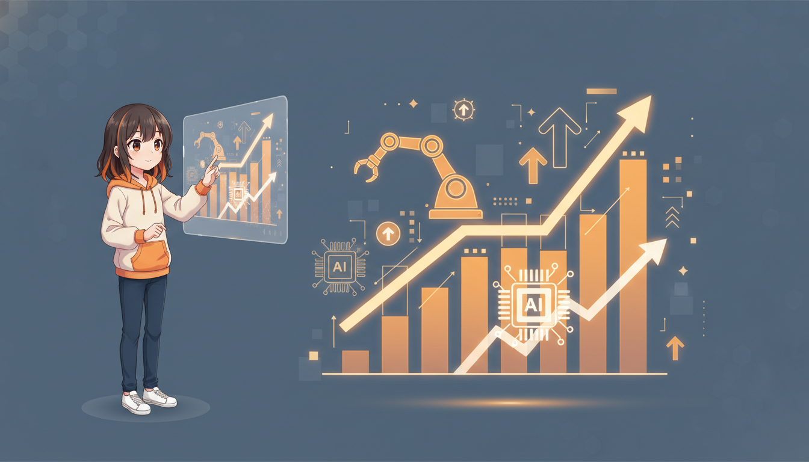
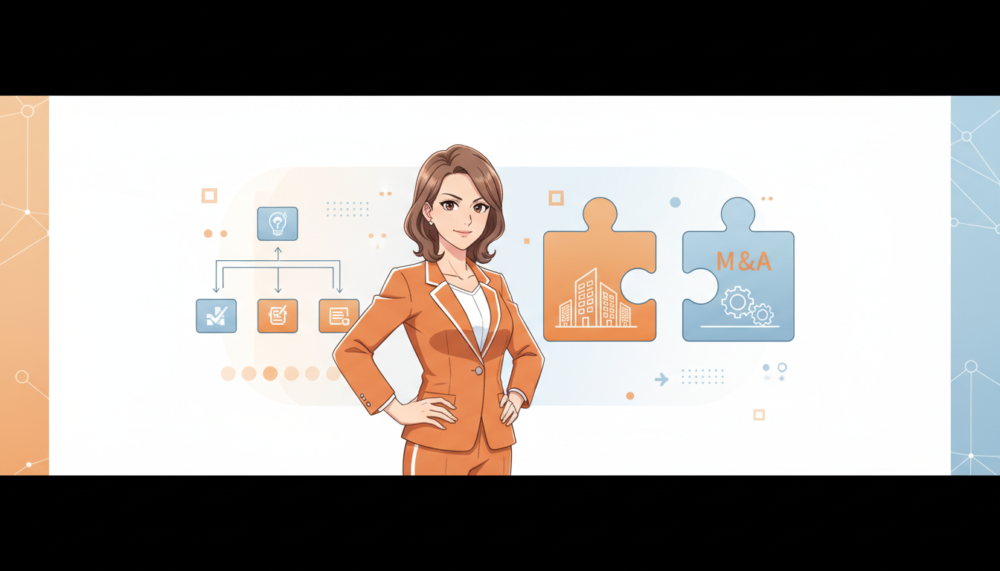
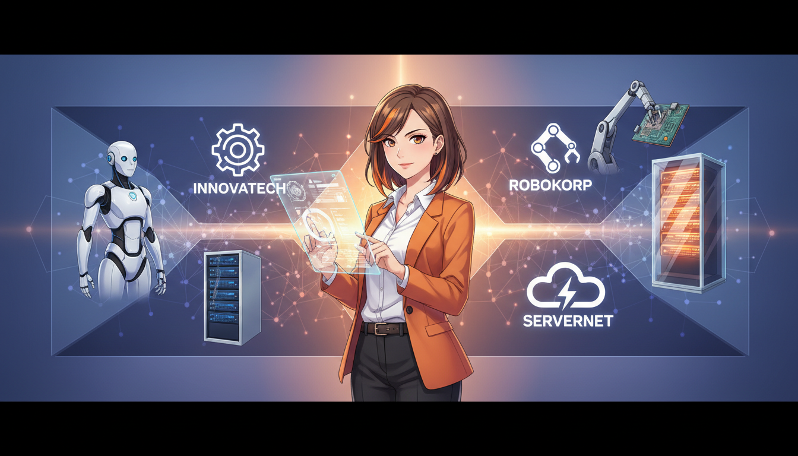
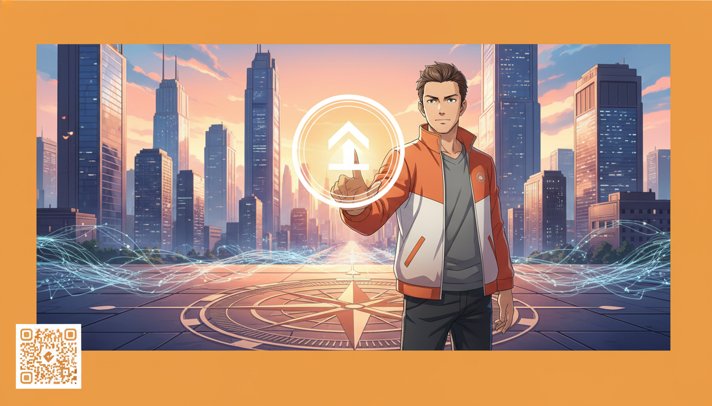

<!-- _class: lead -->

# 2026年 AIとM&Aの未来予測

## Physical AI、Vertical AI、そして資本戦略の融合

**if(塾) Blog** | 2026年01月07日

---

# 2026年の市場概況：転換点

## テクノロジーと資本の動きが加速

- M&A件数は増加傾向（2025年は1,344件を記録）
- xAIなどのAI企業が巨額資金調達を実施
- 「AIの実装」と「企業の統合」が同時進行する年
- 労働力不足解消の切り札としてAIへの期待が高まる

---

# トレンド1：AIの進化と細分化

## Physical AIとVertical AIの台頭

- Physical AI：Closer Robotics等、実世界で動くAIロボット
- Vertical AI：特定業界に特化した課題解決型AI
- LLM（大規模言語モデル）から、より具体的・物理的な応用へ
- 現場の労働力不足を直接解決するソリューションが鍵

---

# トレンド2：資金調達とM&A戦略

## スタートアップのエグジット戦略の多様化

- xAIが数十億ドル規模の調達、NVIDIA GPUへの投資加速
- 株式投資型クラファン（FUNDINNO）が新たな資金源に
- 大企業によるM&AがR&D（研究開発）の代替手段となる
- IPOだけでなくM&Aによるイノベーション統合が主流化

---

# 注目すべきケーススタディ

## 市場を牽引するプレイヤーたち

- xAI：圧倒的な計算資源でAGI（汎用人工知能）を目指す
- Closer Robotics：AI×ロボティクスで省人化を実現
- Strike：M&A仲介プラットフォームとして市場を活性化
- Presta：AIを活用した精密な与信・資金調達モデル

---

# 成功への5つの戦略的提言

## 2026年を勝ち抜くためのアクション

- PMF（製品市場適合）の徹底：顧客課題に深く刺さるか
- Vertical化：特定領域での圧倒的な強みを確立せよ
- 資本提携の活用：自前主義を捨て、M&Aや提携を視野に
- LTV（顧客生涯価値）の最大化：持続可能な収益モデル
- AI実装：業務効率化だけでなく、製品のコアにAIを

---

# まとめ：2026年の展望

## AI×M&Aが創る新産業構造

- 「Web上のAI」から「物理世界のAI」へのシフト
- M&Aは単なる買収ではなく、成長のための必須エンジン
- 多様な資金調達手段がエコシステムを加速させる
- 変化のスピードに対応できる企業のみが生き残る

---

# Next Action

## 今すぐ動き出しましょう

- 自社ビジネスへのPhysical/Vertical AI導入を検討する
- M&Aや資本提携の可能性をリサーチする
- CES 2026などの最新トレンドを定点観測する
- お問い合わせ：AI導入・M&A戦略のご相談はこちら
