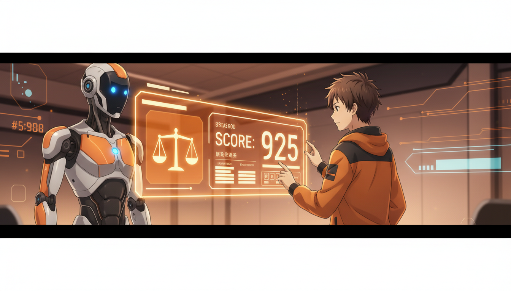
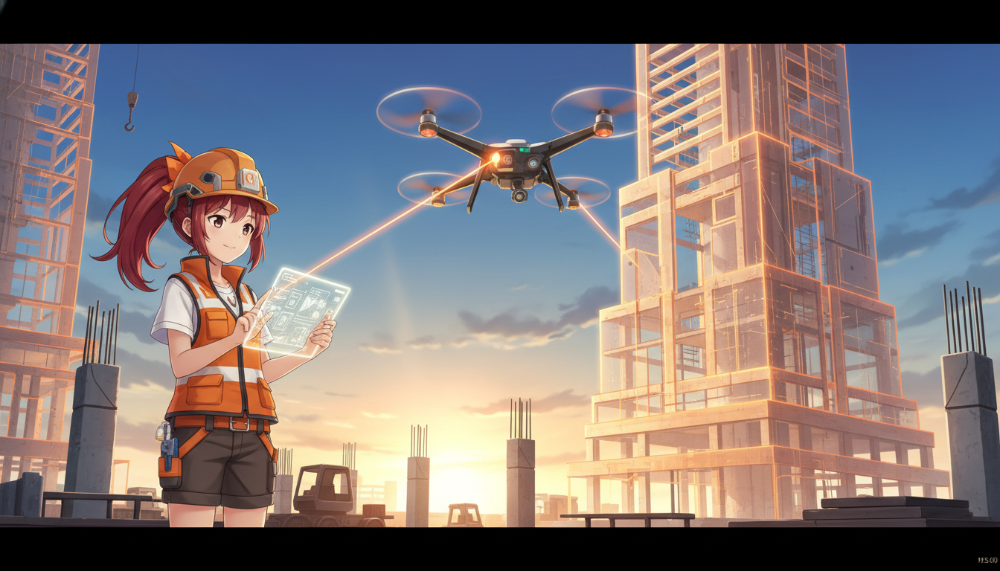

<!-- _class: lead -->

# 2026年 M&A・AI・Deep Tech 最新トレンド

## 加速する産業再編と技術革新の波を読み解く

**if(塾) Blog** | 2026年01月07日

---

# 2026年の市場環境：3つの主要テーマ

## ビジネスを動かす核心的な潮流

- M&A市場は35.7兆円規模へ拡大し活況を維持
- AIは「生成」競争から「評価・信頼性」のフェーズへ
- Deep Tech（建設・インフラ）とAIの融合が加速

---

# M&A市場の拡大と展望

## 過去最多レベルの活況と企業の意欲

- 2025年は件数5,115件(+8.8%)、総額35兆円超
- 2026年も中堅企業の約58%が買収に意欲的
- AI技術や人材獲得を目的としたM&Aが増加傾向

---

# AIトレンド：信頼性と評価基盤の確立

## 性能競争から実用的な品質保証へ

- AI評価PF「LMArena」が1.5億ドルの大型調達
- LLM開発は「性能向上」に加え「人間による評価」を重視
- 企業導入におけるAIの信頼性担保が重要な鍵に

---

# Deep Tech × AI：リアル産業の革新

## 建設・インフラ分野での実装加速

- 建設DX「H2 Corporation」等がVCから大型調達
- ドローンや衛星データを活用したインフラ管理の進化
- 「SaaS」を超え実世界を変える「Deep Tech」へ資金集中

---

# まとめ：2026年を勝ち抜く戦略

## 変化の波を機会に変えるために

- AI活用は「導入」から「評価・改善」の実践段階へ
- M&Aによる迅速な技術・リソース獲得が成長の近道
- リアル産業×テクノロジーの領域に大きな商機あり
