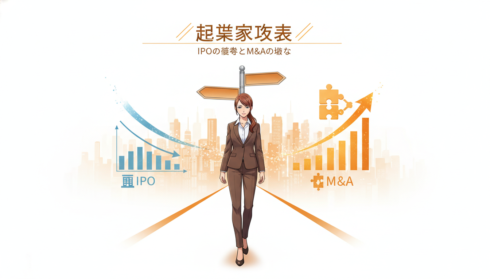
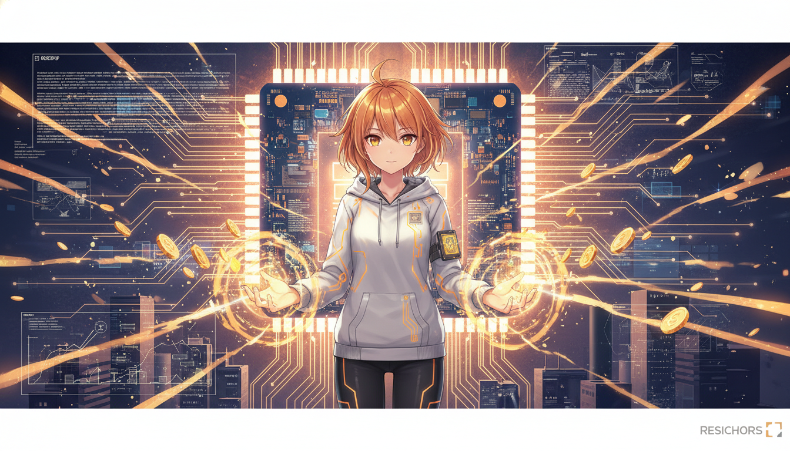
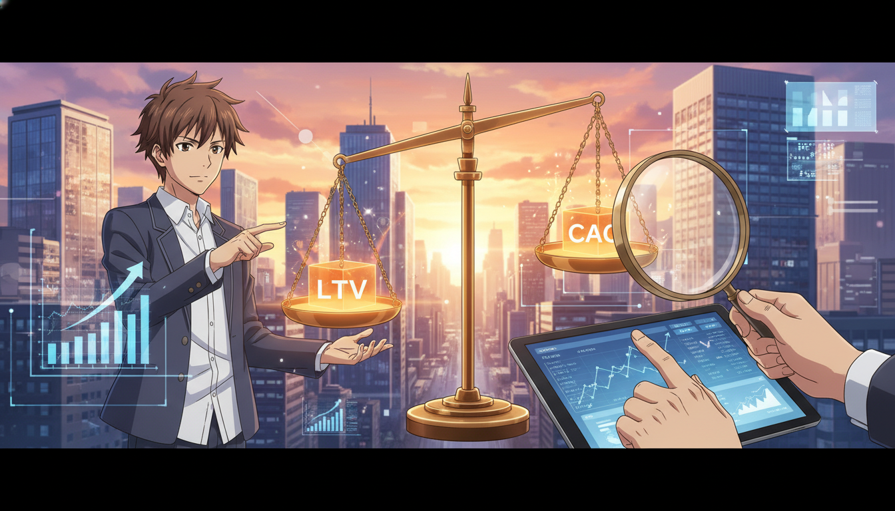

<!-- _class: lead -->

# 2026年市場展望：M&AとAIの融合

## スタートアップ・投資環境の激変と生存戦略

**if(塾) Blog** | 2026年01月07日

---

# 市場環境の激変：IPOからM&Aへ

## Exit戦略の構造変化

- IPOは狭き門へ（Exit全体の約8.8%のみ）
- M&AがExitの主流に（2025年実績：5,115件）
- 「とにかく成長」から「利益重視」へトレンド転換

---

# AIトレンド：勝者総取りの時代

## xAIとDeep Techへの資金集中

- xAIがNVIDIA等から巨額調達（200億ドル規模）
- AI市場は「Winner takes all（勝者総取り）」の様相
- 生成AIからDeep Tech領域へ関心が拡大

---

# 投資基準の厳格化：健全性の追求

## Unit Economicsの重要性

- LTV/CAC > 3倍 が2026年の必須基準
- VCは「選別と確信」を重視するフェーズへ
- 2021年頃のFOMO（機会損失への恐怖）投資からの脱却

---

# 2026年の生存戦略

## スタートアップが取るべきアクション

- M&Aやカーブアウトを戦略的選択肢に含める
- PMFの早期達成と財務規律の徹底
- CVCや事業会社との連携強化（FUNDINNO等の活用）

---

# まとめ：新時代を勝ち抜くために

## 結論と提言

- AI/Deep Techへの適応が競争優位の鍵
- Exit戦略の多様化（IPOに固執せずM&Aも検討）
- 収益性（Unit Economics）の確立を最優先に
