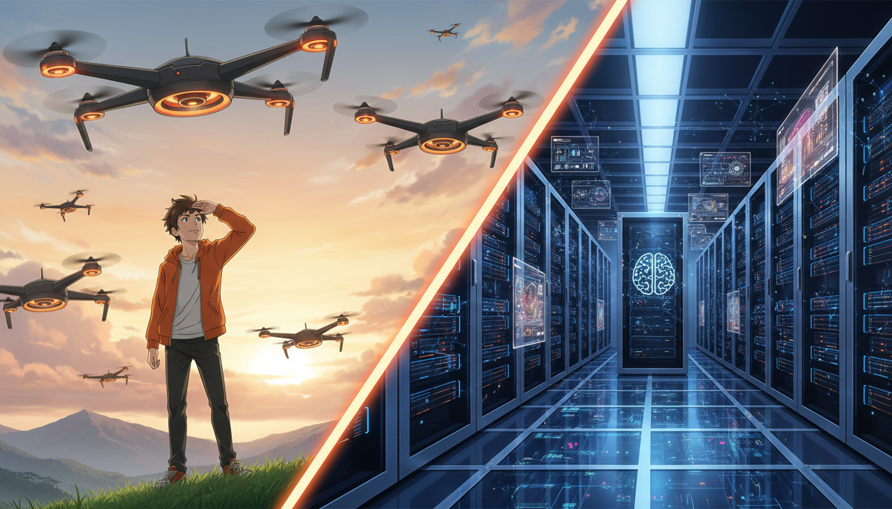

<!-- _class: lead -->

# 2026年 AI投資の展望：Precision Funding

## 成長率至上主義から「利益と実世界AI」への転換点

**if(塾) Blog** | 2026年01月07日

---

# 市場環境の変化：デジタルからPhysical AIへ

## CES 2026に見る新たな潮流

- SaaS/SNSの時代から「実世界AI (Physical AI)」へシフト
- 金利上昇(1.45%)に伴い、資金調達の難易度が上昇
- CES 2026では日本発のハードウェア×AI企業が躍進

---

# 新潮流：Precision Funding（精密投資）

## VC選別基準の厳格化

- 投資採択率は約1/122、VCは「確実性」を重視
- 成長速度(Growth)より「ユニットエコノミクス」を評価
- Burn Multipleを抑制し、持続可能な財務体質が必須

---

# 新指標：DAP (Daily Active Profitability)

## ユーザー数(DAU)から利益(DAP)へ

- 単なるユーザー獲得ではなく「日次利益」が重要指標に
- MVP（実用最小限の製品）段階から収益化を意識
- LTV（顧客生涯価値）とCAC（獲得コスト）の適正化

---

# 注目事例：SORA Technology & DayOne

## 資金調達に成功した日本企業の共通点

- SORA: ドローン×AIでグローバルヘルス課題を解決
- DayOne: 生成AI基盤で2億ドル超の大型調達(Series C)
- 共通点は「深いMoat（競合優位性）」と「社会実装」

---

# 結論：2026年を勝ち抜く戦略

## AI Wrapperからの脱却とPMF

- 既存モデルの「ガワ(Wrapper)」を超えた独自価値の創出
- シミュレーション技術(SimViz)を活用し開発を効率化
- 「Precision（精密さ）」を持った事業計画で信頼を獲得
